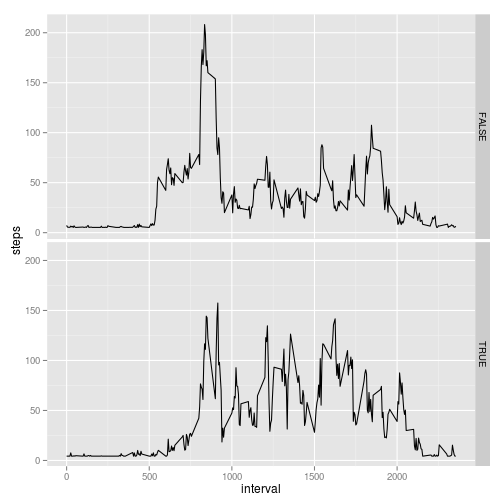

Reproducible Research: Peer Assessment 1
================================================

## Loading and preprocessing the data

```r
activity<-read.csv("activity.csv")

#activity$date<-strptime(activity$date, format="%Y-%m-%d")
str(activity)
```

```
## 'data.frame':	17568 obs. of  3 variables:
##  $ steps   : int  NA NA NA NA NA NA NA NA NA NA ...
##  $ date    : Factor w/ 61 levels "2012-10-01","2012-10-02",..: 1 1 1 1 1 1 1 1 1 1 ...
##  $ interval: int  0 5 10 15 20 25 30 35 40 45 ...
```


## What is mean total number of steps taken per day?

Histogram:

```r
stepsbyday<-aggregate(steps ~ date,activity, sum  )
hist(stepsbyday$steps)
```

 


The mean total number of steps taken per day is:

```r
mean(stepsbyday$steps)
```

```
## [1] 10766
```


##What is the average daily activity pattern?

The time series plot below shows the 5-minute interval (x-axis) and the average number of steps taken, averaged across all days (y-axis)


```r
library(ggplot2)
stepsbyinterval<-aggregate(steps ~ interval,activity, mean  )
qplot(interval,data=stepsbyinterval, steps, geom="line")
```

 

Maximum average number of steps:

```r
maxavgsteps<-max(stepsbyinterval$steps)
maxavgsteps
```

```
## [1] 206.2
```
hich 5-minute interval, on average across all the days in the dataset, contains the maximum number of steps:

```r
 maxindices<-stepsbyinterval$steps==maxavgsteps
stepsbyinterval$interval[maxindices]
```

```
## [1] 835
```

## Inputing missing values

Number of NAs

```r
activitynavector<- is.na(activity)
sum(activitynavector)
```

```
## [1] 2304
```

The chosen strategy to fill in the missing values in the dataset is to use the mean number steps in an interval for the day of the week correpsonding to the NA value.


Fill in NAs


```r
activitytidy<-activity
activitytidy$dayofweek <-weekdays(as.Date(activitytidy$date))
meanstepsbyweekday<-aggregate(steps ~ dayofweek,activitytidy, mean  )

activitymeans<-merge(activitytidy,meanstepsbyweekday, by.x="dayofweek",by.y="dayofweek")
activitytidy[activitynavector,]$steps<-activitymeans[activitynavector,]$steps.y
stepsbydaytidy<-aggregate(steps ~ date,activity, sum  )
```


Note that the histogram is identical to the one reported before filling in the NAs.


```r
hist(stepsbyday$steps)
```

 


Mean and median number of the steps taken per day. Note that the mean is vey close to the one reported before filling in the NAs.


```r
stepsbydaytidy<-aggregate(steps ~ date,activitytidy, sum  )
mean(stepsbydaytidy$steps)
```

```
## [1] 10802
```

```r
median(stepsbydaytidy$steps)
```

```
## [1] 10765
```


## Are there differences in activity patterns between weekdays and weekends?
AS it can be noted there are differences in activity patterns between weekdays and weekends.


```r
activitytidy$weekend <-(activitytidy$dayofweek=="Domingo" | activitytidy$dayofweek=="Sábado")


stepsbyweekday<-aggregate(steps ~ interval+weekend,activitytidy, mean  )

qplot(interval,data=stepsbyweekday, steps, geom="line", facets=weekend ~ .)
```

 
